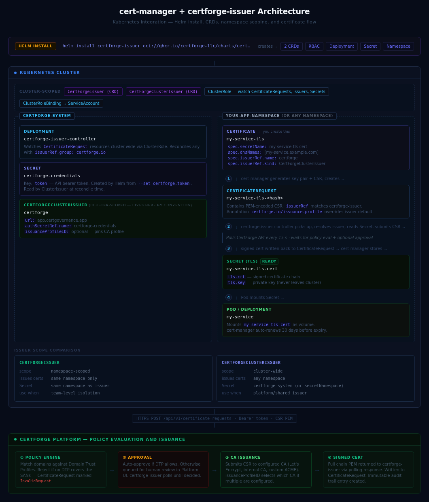

# certforge-issuer

cert-manager external issuer that adds policy enforcement, approval workflows, and a full
audit trail to every certificate request in your cluster.

[](LICENSE)

---

cert-manager automates certificate renewal. It doesn't control *who* can request *what*.
**certforge-issuer** bridges cert-manager to CertForge's policy engine so every certificate
request is evaluated against your Domain Trust Profiles — and your security team gets an
immutable audit trail of what was issued, when, and who approved it.

```
Pod → cert-manager → certforge-issuer → CertForge API → CA
                                      ← signed cert   ←
```

## Why

Without a policy layer, any workload with a cert-manager `Certificate` resource can request a
certificate for any domain in your cluster — `*.production.example.com`, internal CA subjects,
anything. There is nothing to stop it.

**certforge-issuer adds:**

- **Domain Trust Profiles** — define which CAs, SANs, and wildcard patterns are valid per domain
- **Approval workflows** — route certificate requests to a human approver before issuance
- **Policy enforcement** — requests that don't match a Trust Profile are denied before reaching a CA
- **Audit trail** — every request, approval, and renewal is logged with actor, timestamp, and outcome

Your cert-manager setup stays exactly as-is. Add certforge-issuer as the external issuer and
governance is in place without changing a single workload manifest.

## Prerequisites

- Kubernetes 1.24+
- cert-manager v1.14+
- A CertForge account — [free tier](https://certgovernance.app) includes 100 certificates,
  25 domains, full approval workflows, and audit log export. No credit card required.

### CertForge setup (required before installation)

The issuer will reject certificate requests if CertForge is not configured for your domains.
Complete these steps first — they take about five minutes.

1. **Create an account** at [certgovernance.app](https://certgovernance.app) and set up your organization.

2. **Add your domains** — in CertForge, create a Domain Trust Profile (DTP) that covers the
   domains your Kubernetes workloads will request certificates for. The DTP defines which CA to
   use, whether wildcards are permitted, and whether requests require manual approval.

   Example: if your workloads will request certs for `*.internal.example.com`, your DTP must
   include that pattern (or `*.example.com`). Requests for domains not covered by any DTP are
   rejected with an `InvalidRequest` condition on the `CertificateRequest`.

3. **Generate an API token** — go to Settings → API Keys and create a token with the **enroll**
   and **read** scopes. You'll supply this token during Helm installation in the next step.

## Quick Start

**Install the issuer** (the Helm chart creates a `certforge-credentials` Secret in
`certforge-system` automatically from the token you provide):

```bash
helm install certforge-issuer oci://ghcr.io/certforge-llc/charts/certforge-issuer \
  --namespace certforge-system \
  --create-namespace \
  --set certforge.url=https://app.certgovernance.app \
  --set certforge.token=<your-api-token>
```

**Create an issuer resource** in each namespace that needs certificates (or use
`CertForgeClusterIssuer` for cluster-wide access — see [Usage](#usage)):

```yaml
apiVersion: certforge.io/v1alpha1
kind: CertForgeIssuer
metadata:
  name: certforge
  namespace: default
spec:
  url: https://app.certgovernance.app
  authSecretRef:
    name: certforge-credentials
```

> The `certforge-credentials` Secret was created by the Helm chart above.
> For `CertForgeClusterIssuer`, the Secret must be in the `certforge-system` namespace
> (or the namespace set in `secretNamespace`).

**Reference it from your Certificate:**

```yaml
apiVersion: cert-manager.io/v1
kind: Certificate
metadata:
  name: my-cert
  namespace: default
spec:
  secretName: my-cert-tls
  dnsNames:
    - my-service.example.com
  issuerRef:
    name: certforge
    kind: CertForgeIssuer
    group: certforge.io
```

cert-manager creates a `CertificateRequest`, the controller submits it to CertForge for policy
evaluation, and the signed certificate is returned once approved and issued.

### A note on cert-manager approval

cert-manager's built-in approver only auto-approves requests for its own built-in issuers (ACME,
CA, SelfSigned). For `certforge-issuer`, `CertificateRequest` objects will show an empty
`APPROVED` column until they are approved — the controller will not submit the CSR to CertForge
until the Approved condition is set.

**For production:** install
[cert-manager-approver-policy](https://cert-manager.io/docs/policy/approval/approver-policy/)
and deploy a `CertificateRequestPolicy` that targets `certforge.io`. CertForge
already enforces domain policy via Domain Trust Profiles, so the Kubernetes-side
rule just needs to unblock the approval gate:

```bash
# Install cert-manager-approver-policy
helm repo add jetstack https://charts.jetstack.io && helm repo update
helm upgrade cert-manager-approver-policy \
  jetstack/cert-manager-approver-policy \
  --install --namespace cert-manager --wait

# Disable the built-in approver (required when using approver-policy)
helm upgrade cert-manager jetstack/cert-manager \
  --namespace cert-manager --reuse-values \
  --set disableAutoApproval=true

# Apply the policy
kubectl apply -f https://raw.githubusercontent.com/CertForge-LLC/certforge-issuer/main/config/samples/approver-policy.yaml
```

The sample policy approves any request targeting a `certforge.io` issuer.
Namespace-scoped and domain-scoped variants are included (commented out) in the
same file. See [config/samples/approver-policy.yaml](config/samples/approver-policy.yaml).

**For local testing:** approve manually with `cmctl`:

```bash
cmctl approve <certificaterequest-name> -n <namespace>
```

## Usage

### Cluster-scoped Issuer

For issuing certificates across all namespaces:

```yaml
apiVersion: certforge.io/v1alpha1
kind: CertForgeClusterIssuer
metadata:
  name: certforge
spec:
  url: https://app.certgovernance.app
  authSecretRef:
    name: certforge-credentials
```

The Secret is read from the `certforge-system` namespace by default. Use `secretNamespace` to
override this if your credentials live elsewhere.

### Data Residency

CertForge operates in **US East** and **EU West**. Your organization's certificates, keys, and
audit data are pinned to a single region by the API token — no cross-border data flows occur.

Set `url` to the appropriate endpoint for your org's region:

| Region | URL |
|--------|-----|
| US East (default) | `https://app.certgovernance.app` |
| EU West (GDPR-aligned) | `https://eu.certgovernance.app` |

The `url` and API token together route every certificate request to the correct region. No other
configuration is needed.

**EU West example:**

```yaml
apiVersion: certforge.io/v1alpha1
kind: CertForgeClusterIssuer
metadata:
  name: certforge-eu
spec:
  url: https://eu.certgovernance.app
  authSecretRef:
    name: certforge-eu-credentials
```

```bash
kubectl create secret generic certforge-eu-credentials \
  --namespace certforge-system \
  --from-literal=token=<your-eu-org-api-token>
```

### Issuance Profiles

If your Domain Trust Profile has multiple CA configurations (for example, Let's Encrypt for
external certs and an internal CA for service-mesh certs), you can pin an issuance profile at the
issuer level or override it per Certificate.

**Issuer-level default** — all certs from this issuer use the specified profile:

```yaml
apiVersion: certforge.io/v1alpha1
kind: CertForgeClusterIssuer
metadata:
  name: certforge-internal
spec:
  url: https://app.certgovernance.app
  authSecretRef:
    name: certforge-credentials
  issuanceProfileID: "your-internal-ca-profile-id"
```

**Per-Certificate override** — set the `certforge.io/issuance-profile` annotation on a
`Certificate` resource to override the issuer default for that certificate only:

```yaml
apiVersion: cert-manager.io/v1
kind: Certificate
metadata:
  name: external-cert
  namespace: default
  annotations:
    certforge.io/issuance-profile: "your-letsencrypt-profile-id"
spec:
  secretName: external-cert-tls
  dnsNames:
    - api.example.com
  issuerRef:
    name: certforge-internal
    kind: CertForgeClusterIssuer
    group: certforge.io
```

The annotation takes precedence over `issuanceProfileID` in the issuer spec. If neither is set,
CertForge uses the default profile configured on the matching Domain Trust Profile.

### Custom Secret Namespace (ClusterIssuer)

By default `CertForgeClusterIssuer` reads credentials from `certforge-system`. Override this with
`secretNamespace`:

```yaml
apiVersion: certforge.io/v1alpha1
kind: CertForgeClusterIssuer
metadata:
  name: certforge
spec:
  url: https://app.certgovernance.app
  authSecretRef:
    name: certforge-credentials
  secretNamespace: my-secrets-namespace
```

### Manual Installation (without Helm)

```bash
kubectl apply -f https://raw.githubusercontent.com/CertForge-LLC/certforge-issuer/main/config/crd/certforge-issuer.yaml
kubectl apply -f https://raw.githubusercontent.com/CertForge-LLC/certforge-issuer/main/config/rbac/rbac.yaml

kubectl create secret generic certforge-credentials \
  --namespace certforge-system \
  --from-literal=token=<your-api-token>

kubectl apply -f https://raw.githubusercontent.com/CertForge-LLC/certforge-issuer/main/config/manager/deployment.yaml
```

## How It Works



1. cert-manager creates a `CertificateRequest` with `issuerRef.group: certforge.io`
2. The controller POSTs the CSR to `POST /api/v1/certificate-requests`
3. CertForge checks the request against your Domain Trust Profiles
   - If no DTP covers the requested domains, the `CertificateRequest` is marked `InvalidRequest`
     and no retry occurs — add the domain to a DTP in CertForge to resolve
4. If auto-approval is configured, the certificate is issued immediately
5. If manual approval is required, the request waits in CertForge's approval queue
6. The controller polls every 15 seconds until issued or denied
7. On issuance, the signed certificate is written back to the `CertificateRequest`
8. cert-manager stores the key + certificate as a Kubernetes Secret

### Troubleshooting

If a `Certificate` stays pending, check the underlying `CertificateRequest`:

```bash
kubectl describe certificaterequest <name> -n <namespace>
```

| Condition | Reason | Cause |
|-----------|--------|-------|
| `InvalidRequest=True` | `PolicyViolation` | Domain not covered by any CertForge DTP, or wildcard not permitted |
| `Denied=True` | `Denied` | Request was manually denied in the CertForge approval queue |
| `Denied=True` | `PreviouslyDenied` | A previous request for this Certificate was denied; cert-manager created a retry CR |
| `Ready=False` | `Pending` | Waiting for approval in CertForge, or transient connectivity issue |
| `Ready=False` | `IssuerNotReady` | The Issuer/ClusterIssuer is not Ready — see issuer status below |

Check the issuer status:

```bash
kubectl get certforgeissuer -n <namespace>          # namespace-scoped
kubectl get certforgeclusterissuer                  # cluster-scoped
kubectl describe certforgeclusterissuer certforge   # full status + conditions
```

## Failure Modes & Operator Runbook

### Issuer shows Ready=False

**Reason: `PingFailed` — "token rejected by CertForge (401 Unauthorized)"**

The token in the credentials Secret is invalid, expired, or was revoked.

```bash
# Identify the Secret name
kubectl get certforgeclusterissuer certforge -o jsonpath='{.spec.authSecretRef.name}'

# Replace the token (certforge-system namespace for ClusterIssuer)
kubectl create secret generic certforge-credentials \
  --namespace certforge-system \
  --from-literal=token=<new-token> \
  --dry-run=client -o yaml | kubectl apply -f -
```

The issuer reconciler retries every 30 seconds; Ready=True should appear within a minute.

---

**Reason: `PingFailed` — "token lacks required scope (403 Forbidden)"**

The token exists and is valid, but was created without the `read` scope. Issuer tokens need both `enroll` and `read`.

Go to **CertForge → Settings → API Keys**, revoke the existing token, and create a new one with `enroll + read` scopes. Update the Secret as shown above.

---

**Reason: `PingFailed` — "cannot reach CertForge at https://..."**

The controller pod cannot reach the CertForge API. Common causes:

1. **Network policy blocking egress** — the controller needs outbound HTTPS (port 443) to `app.certgovernance.app` (US) or `eu.certgovernance.app` (EU).
2. **Wrong URL in spec** — verify `spec.url` matches the region your token was issued for.
3. **DNS resolution failure** — check that cluster DNS can resolve the hostname.

```bash
# Confirm the controller is running
kubectl get pods -n certforge-system

# Check controller logs for detail
kubectl logs -n certforge-system deploy/certforge-issuer-controller-manager

# Test egress from inside the cluster (if you have a debug pod)
kubectl run -it --rm debug --image=curlimages/curl --restart=Never -- \
  curl -sI https://app.certgovernance.app/api/v1/ping \
  -H "Authorization: Bearer <token>"
```

---

**Reason: `SecretNotFound`**

The credentials Secret doesn't exist in the expected namespace.

- For `CertForgeClusterIssuer`: Secret must be in `certforge-system` (or the namespace set in `secretNamespace`).
- For `CertForgeIssuer`: Secret must be in the same namespace as the issuer.

```bash
kubectl create secret generic certforge-credentials \
  --namespace certforge-system \
  --from-literal=token=<your-api-token>
```

---

### Certificate stuck in Pending — approval queue

When a Domain Trust Profile requires manual approval, `CertificateRequest` objects stay in `Ready=False / Pending` until a CertForge approver acts. This is expected behavior, not an error.

```bash
# See how long the request has been waiting
kubectl describe certificaterequest <name> -n <namespace>
# The Ready condition message shows "submitted Xh Ym ago"
```

Approvers action requests in the **CertForge → Approvals** queue. If a request is urgent, an admin can approve it there directly.

---

### Certificate stuck in Pending — no matching DTP

```
Condition: InvalidRequest=True
Reason: PolicyViolation
Message: Domain not covered by any CertForge DTP ...
```

The requested domain (SAN) is not covered by any Domain Trust Profile for your org. Options:

1. Add the domain to an existing DTP in CertForge.
2. Create a new DTP that covers the domain pattern.
3. If this cert should not be issued, the `InvalidRequest` condition is terminal — no retry will occur.

---

### Human-denied request keeps generating new approval notifications

cert-manager's Certificate controller creates new `CertificateRequest` objects on an exponential backoff (≈1h, 2h, …) even after a request is `Denied=True`. The issuer detects this via the `certforge.io/denied-at` annotation on the parent Certificate and denies retry CRs immediately without re-submitting to CertForge.

If you are seeing repeated approval notifications, the parent Certificate may have been recreated (which loses the annotation). **Breaking the cycle:**

```bash
# Option 1: delete the Certificate (and let cert-manager recreate it fresh)
kubectl delete certificate <name> -n <namespace>

# Option 2: if the cert should never be issued, delete the Certificate
# and remove the workload's cert-manager annotations/volume mounts
```

---

### Controller pod crashlooping or not starting

```bash
kubectl describe pod -n certforge-system -l app=certforge-issuer-controller-manager
kubectl logs -n certforge-system deploy/certforge-issuer-controller-manager --previous
```

Common causes:
- **CRDs not installed** — run `kubectl apply -f config/crd/certforge-issuer.yaml` before deploying the controller.
- **RBAC missing** — run `kubectl apply -f config/rbac/rbac.yaml`.
- **Leader election conflict** — if two controller instances are running in the same namespace, one will fail to acquire the leader lease. Ensure only one Helm release is installed per cluster.

## Spec Reference

### CertForgeIssuerSpec (shared by `CertForgeIssuer` and `CertForgeClusterIssuer`)

| Field | Required | Description |
|-------|----------|-------------|
| `url` | Yes | Base URL of the CertForge server. Determines the data region. |
| `authSecretRef.name` | Yes | Name of the Secret containing a `token` key with the API bearer token. |
| `issuanceProfileID` | No | Default issuance profile ID for all certs from this issuer. Overrides the DTP default. Can be overridden per Certificate via the `certforge.io/issuance-profile` annotation. |
| `secretNamespace` | No | Namespace to read the credentials Secret from (`CertForgeClusterIssuer` only). Defaults to `certforge-system`. |

### Annotations

| Annotation | Resource | Description |
|------------|----------|-------------|
| `certforge.io/issuance-profile` | `Certificate` | Overrides `issuanceProfileID` from the issuer spec for this certificate only. |

## Building

```bash
go build ./...
docker build -t certforge-issuer:dev .
```

## Get Started Free

[certgovernance.app](https://certgovernance.app) — 100 certificates, 25 domains, full approval
workflows, audit log and export. No credit card required.

## License

Apache 2.0
